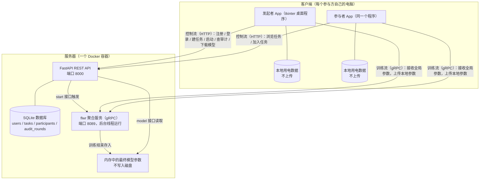
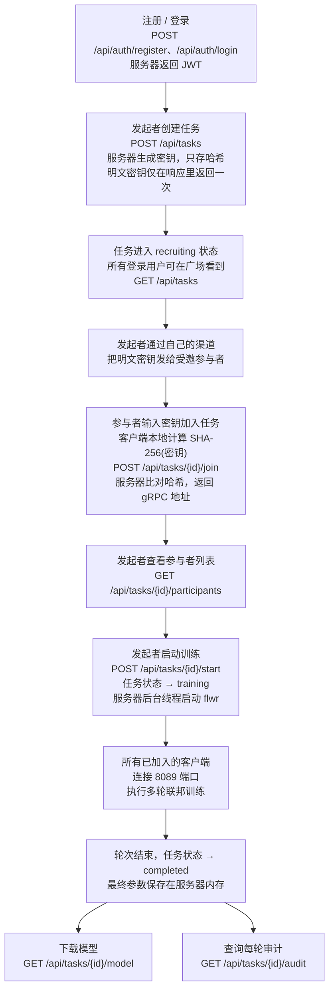
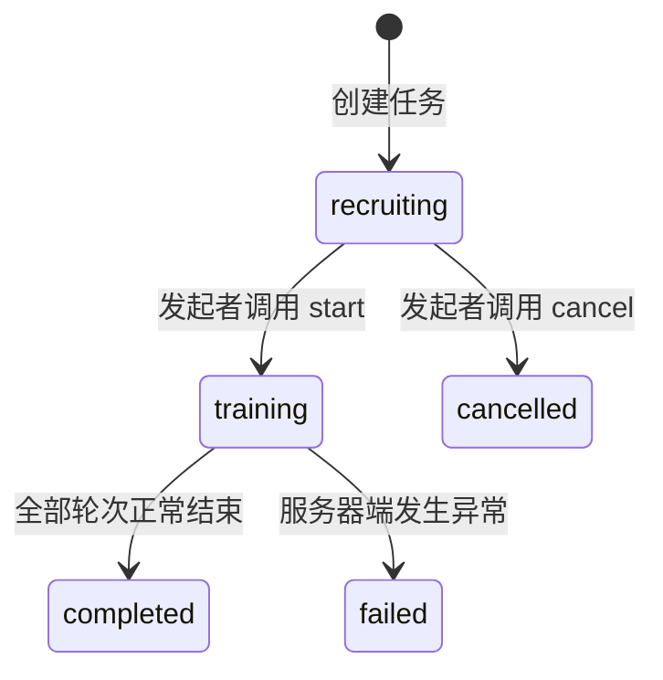
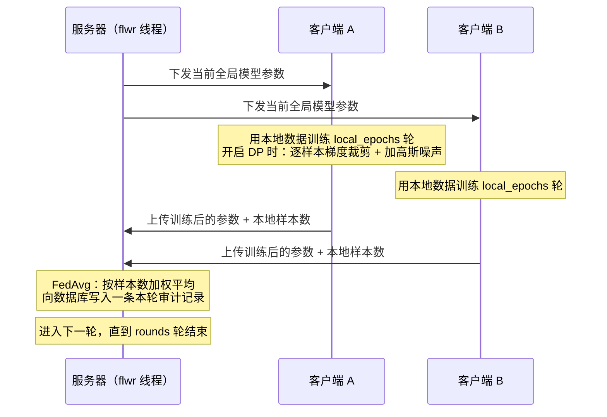

# 联邦学习系统讲稿（面向大一同学）

> 用途：向客户端开发组的三位同学讲解系统的整体设计、运行流程和各自的任务。
> 预计时长：25–30 分钟。`【图】` 标记处切换到对应插图。
> 依据文档：`docs/superpowers/specs/2026-08-17-fl-app-redesign-design.md`（设计规格）、`docs/superpowers/plans/2026-08-17-fl-app-redesign.md`（16 任务实施计划）。

---

## 0. 开场（1 分钟）

大家好。今天把我们要做的这套系统完整讲一遍。讲完以后，你们会知道三件事：

1. 这个系统解决什么问题，为什么用联邦学习；
2. 一次完整的联邦学习任务从创建到结束，每一步发生了什么；
3. 你们每个人要写哪些代码，依赖谁，什么时候验收。

服务器端代码已经全部完成并通过测试，你们的工作集中在客户端，也就是 `app/` 目录。

---

## 1. 系统解决什么问题（3 分钟）

我们参加的比赛题目是：多个用电主体——工业园区、商业楼宇、居民社区、新能源园区——共同训练一个用电负荷预测模型。

核心约束只有一条：**任何参与方的原始用电数据不允许离开自己的机器**。

但模型训练需要足够多的数据。数据不能集中，又要一起训练，这就是联邦学习（Federated Learning）的定义：

- 每个参与方在自己的机器上，用自己的数据训练模型；
- 训练得到的**模型参数**上传给服务器；
- 服务器把所有人的参数做加权平均，得到全局模型参数；
- 全局参数再发回给每个人，继续下一轮训练。

数据始终在本地，流动的只有模型参数。

我们在参数流动这一层再加了一道保护：**差分隐私（DP）**。开启 DP 时，每个客户端在上传参数之前，对梯度做裁剪并加入高斯噪声。这样即使有人截获了上传的参数，也无法从中还原出某一条具体用电记录。第 6 节会展开讲。

我们用的模型是 TCN（Temporal Convolutional Network，时间卷积网络），输入 30 分钟粒度的历史负荷和公共特征，输出未来时段的预测值。模型结构你们不需要改，直接调用 `fl_code/models/` 里现成的代码。

---

## 2. 整体架构

`【图 1：架构图】`



系统只有两类进程：**服务器**和**客户端**。

**服务器**是一台独立部署的机器，用 Docker Compose 容器化运行，和任何用户都没有绑定关系。它内部跑的是同一个进程里的两个部分：

- **FastAPI REST API**，监听 8000 端口，处理所有 HTTP 请求：注册登录、任务管理、审计查询、模型下载；
- **flwr 聚合服务**，监听 8089 端口，负责训练期间的参数收发和加权平均。它在训练开始时由 REST API 在后台线程里启动。

服务器用 SQLite 数据库存四类数据：用户、任务、参与者、每一轮的审计记录。

**客户端**是你们要写的 tkinter 桌面程序，代码在 `app/` 目录。每个参与方运行一份，程序里包含登录界面、任务列表界面、训练界面。客户端通过两条通道和服务器通信：

- **HTTP**（8000 端口）：所有管理类操作；
- **gRPC**（8089 端口）：只在训练期间使用，收发模型参数。

要强调三点：

1. 服务器**不存原始数据**——数据始终在每个客户端本地；
2. 服务器**不存明文密钥**——只存密钥的 SHA-256 哈希值；
3. 服务器**不把模型参数写入磁盘**——训练结果保存在进程内存里，通过接口下载。服务器进程重启后，未下载的最终模型会丢失。

---

## 3. 一次完整任务的流程

`【图 2：任务流程图】`



`【图 3：任务状态流转】`



我按时间顺序讲一遍。

**第一步，注册和登录。** 用户提交用户名和密码。服务器用 bcrypt 对密码做哈希后存入数据库，然后签发一个 JWT（JSON Web Token），有效期 24 小时。之后客户端每次请求都带上这个 JWT，格式是请求头 `Authorization: Bearer <token>`。

**第二步，发起者创建任务。** 提交任务名、训练轮数 rounds，可选提交 DP 参数（dp_epsilon、dp_delta、dp_clip）、本地训练轮数 local_epochs、批大小 batch_size。服务器生成一个 32 位十六进制字符串作为参与密钥，**服务器只保存它的 SHA-256 哈希**，明文只在创建响应里返回这一次。发起者必须自己保存好这个密钥，服务器无法再次提供。

**第三步，任务出现在广场。** 所有登录用户调用 `GET /api/tasks`，服务器返回全部处于 recruiting 状态的任务。广场是公开的：任何人都能看到任务列表，但加入必须持有密钥。

**第四步，参与者加入。** 发起者通过自己的渠道（当面、聊天工具）把明文密钥告诉受邀的人。参与者在客户端输入密钥，**客户端先在本地计算密钥的 SHA-256 哈希，把哈希发给服务器**，同时提交自己的 client_id。服务器比对哈希，一致就登记为参与者，返回 gRPC 地址。同一个任务里 client_id 不能重复。

client_id 是数据身份的标识，取值来自 `fl_code/models/client_config.yaml` 里定义的 9 个客户端，例如 `steel_ind_0`、`lcl_res_0`。每个参与者用哪个 client_id，就用对应的那份本地数据。

**第五步，发起者启动训练。** 调用 start 接口后，服务器把任务状态改为 training，在后台线程里启动 flwr 服务，监听 8089 端口，等待已加入的客户端连接。当前版本同一时间只支持一个任务在训练，因为 gRPC 端口只有一个，服务器会对并发的训练请求报错。

**第六步，多轮联邦训练。** 每一轮的过程如下：

`【图 4：单轮训练时序图】`



审计记录的内容：本轮应到的 client_id 列表、实际参与的列表、掉线的列表、本轮损失值。训练结束后，任何人（限发起者和参与者）可以通过 audit 接口查到每一轮的这些记录。

**第七步，结束。** 全部轮次完成后，任务状态变为 completed。最终的全局模型参数保存在服务器内存中。发起者和参与者可以下载，内容是一个 pickle 序列化的字典，包含参数名列表和对应的 numpy 数组。客户端下载后写入本地文件，用于后续的第二阶段个性化训练——第二阶段只在本地进行，与服务器无关。

如果训练过程中服务器端发生异常，任务状态变为 failed。

---

## 4. 服务器存什么、不存什么（3 分钟）

这一节是隐私设计的核心，验收时评委也会问，大家记住这张表：

| 内容                                  | 服务器是否保存    | 说明                                                                         |
| ------------------------------------- | ----------------- | ---------------------------------------------------------------------------- |
| 用户名、密码哈希（bcrypt）            | 存                | 用于登录验证                                                                 |
| 任务配置（名称、轮数、DP 参数、状态） | 存                | SQLite tasks 表                                                              |
| 参与密钥                              | 只存 SHA-256 哈希 | 明文仅创建时返回一次，之后服务器也无法还原                                   |
| 参与者与 client_id 的对应关系         | 存                | SQLite participants 表                                                       |
| 每轮审计记录                          | 存                | SQLite audit_rounds 表                                                       |
| 原始用电数据                          | **不存**    | 数据始终在客户端本地，任何接口都不传输数据                                   |
| 最终模型参数                          | **不落盘**  | 训练期间在内存中聚合；结束后保存在进程内存供下载；进程重启即丢失             |
| 中间轮次的参数                        | **不留存**  | 每轮客户端上传的参数只用于当轮聚合，聚合完成后内存中只保留最新一轮的全局参数 |

客户端上传的是训练后的模型参数，不是梯度。开启 DP 时，噪声在客户端本地训练阶段已经作用于梯度，服务器收到的参数里已不含任何单条样本的原始梯度信息。

另外两个实现细节：

- 密钥比对用的是 `hmac.compare_digest`，逐字节比较且耗时恒定，防止通过测量响应时间逐位猜出哈希；
- JWT 的签名密钥由环境变量 `JWT_SECRET` 提供，部署时由运维设置，不在代码里写死。

---

## 5. 接口清单（3 分钟）

你们的 `APIClient` 就是把这些接口封装成 Python 方法。所有接口前缀 `/api`，除注册和登录外都需要 JWT 请求头。

| 方法 | 路径                             | 功能                     | 请求体 / 说明                                                                                                                                         |
| ---- | -------------------------------- | ------------------------ | ----------------------------------------------------------------------------------------------------------------------------------------------------- |
| POST | `/api/auth/register`           | 注册                     | `{username, password}` → `{access_token}`                                                                                                        |
| POST | `/api/auth/login`              | 登录                     | 同上                                                                                                                                                  |
| GET  | `/api/me`                      | 验证 token，返回当前用户 | →`{id, username}`                                                                                                                                  |
| POST | `/api/tasks`                   | 创建任务                 | `{name, rounds, round_timeout?, start_at?, dp_epsilon?, dp_delta?, dp_clip?, local_epochs=1, batch_size=64}` → 任务信息 + 明文 `key`（仅此一次） |
| GET  | `/api/tasks`                   | 广场列表                 | 返回所有 recruiting 任务                                                                                                                              |
| GET  | `/api/tasks/{id}`              | 任务详情                 | 任意状态                                                                                                                                              |
| POST | `/api/tasks/{id}/cancel`       | 取消任务                 | 仅发起者，仅 recruiting                                                                                                                               |
| POST | `/api/tasks/{id}/join`         | 加入任务                 | `{key_hash, client_id}`，**key_hash 是客户端算好的 SHA-256** → `{participant_id, grpc_addr, client_id}`                                    |
| GET  | `/api/tasks/{id}/participants` | 参与者列表               |                                                                                                                                                       |
| POST | `/api/tasks/{id}/start`        | 启动训练                 | 仅发起者；需至少 1 名参与者                                                                                                                           |
| GET  | `/api/tasks/{id}/audit`        | 审计记录                 | 仅发起者和参与者                                                                                                                                      |
| GET  | `/api/tasks/{id}/model`        | 下载最终模型             | 仅发起者和参与者；返回二进制字节流                                                                                                                    |
| GET  | `/api/health`                  | 健康检查                 | →`{"status":"ok"}`                                                                                                                                 |

常见错误码：401 未认证或 token 过期；403 无权限或密钥哈希不匹配；404 任务不存在或模型未就绪；409 用户名重复或 client_id 重复；400 状态不允许该操作。

参考代码：`server/routers/` 下四个文件就是这些接口的全部实现；`server/tests/` 下的测试演示了每个接口的请求和响应格式，你们封装接口时可以对照。

---

## 6. 差分隐私（2 分钟）

差分隐私的目标：任何一个参与方退出训练，训练结果的变化都足够小，小到无法判断它是否参与过。

我们的实现方式是客户端 DP-SGD，全部逻辑在 `fl_code/fed_core/client_core.py`，你们调用即可，不需要自己实现。开启 DP 后，客户端每个训练步骤做三件事：

1. 分别计算每条样本的梯度；
2. 对每条样本的梯度做范数裁剪，上界是 `dp_clip`；
3. 加入标准差由 `dp_epsilon`、`dp_delta` 决定的高斯噪声，然后才更新模型。

每个客户端的隐私消耗（ε 预算）记录在**本地文件**里，由客户端自己维护，不经过服务器。参数推导过程见 `docs/差分隐私参数推导说明.md`。

对你们的影响只有一处：Task 13 的训练界面要读取本地预算文件，画出 ε 消耗曲线。

---

## 7. 你们的任务（4 分钟）

客户端代码全部在新建的 `app/` 目录，Python + tkinter + requests + matplotlib。计划文档里每个任务都给出了完整的参考代码，以下按依赖顺序列出。

| 任务    | 产物文件                               | 内容                                                                                                                                                                                               |
| ------- | -------------------------------------- | -------------------------------------------------------------------------------------------------------------------------------------------------------------------------------------------------- |
| Task 3  | `app/api.py`、`app/auth.py`        | `APIClient` 类封装第 5 节的全部接口，内部自动附加 JWT 请求头；`TokenStore` 保存当前 token 和用户名                                                                                             |
| Task 4  | `app/main.py`                        | 主窗口：登录/注册区，广场区和任务区先放占位                                                                                                                                                        |
| Task 7  | `app/forms.py`，修改 `app/main.py` | 广场任务列表；创建任务弹窗；加入任务弹窗（输入密钥和 client_id）                                                                                                                                   |
| Task 12 | `app/fl_client.py`                   | `run_training(grpc_addr, client_id, ...)`：用 `flwr.client.start_client` 连接 8089，训练逻辑复用 `fl_code/fed_core/client_core.py` 的 `FedClient`；`save_model` 把下载的模型字节写入文件 |
| Task 13 | `app/viz.py`，修改 `app/main.py`   | 当前任务区：训练状态轮询、matplotlib 嵌入 tkinter 画 ε 预算曲线、模型下载按钮                                                                                                                     |
| Task 16 | `docs/App部署手册.md`                | 部署手册：服务器 Docker 部署步骤、客户端环境配置、端口说明                                                                                                                                         |

两个验收节点：

- **阶段 A+B 验收（Task 8）**：Task 3、4、7 完成后。验收内容：注册登录、广场刷新、创建任务、凭密钥加入任务，全流程走通；
- **阶段 C 端到端验收（Task 14）**：Task 12、13 完成后。验收内容：两台机器（或同一台机器的两个进程）连接真实服务器，完成一轮完整的联邦训练并下载模型。

依赖关系：Task 3 是 Task 4 和 7 的前置；Task 12 是 Task 13 的前置；Task 16 最后写。建议顺序：3 → 4 → 7 →（验收）→ 12 → 13 →（验收）→ 16。

---

## 8. 本地调试（2 分钟）

服务器镜像已经构建完成，你们在本机启动：

```bash
docker compose up --build -d          # 启动服务器容器
curl http://localhost:8000/api/health # 应返回 {"status":"ok"}
docker compose logs -f fl-server      # 查看服务器日志
```

不用界面也能测接口，例如注册：

```bash
curl -X POST http://localhost:8000/api/auth/register \
     -H "Content-Type: application/json" \
     -d '{"username":"test1","password":"pw123"}'
```

返回的 `access_token` 用于后续请求。开发阶段的两个注意点：

1. 客户端连接 gRPC 时使用的地址是 join 接口返回的 `grpc_addr`。本机调试时是 `127.0.0.1:8089`；跨机器部署时，需要把服务器的 `FL_SERVER_HOST` 环境变量设置为服务器的实际 IP。
2. 训练接口（start、audit、model）在没有人加入或训练未完成时会返回 400 或 404，客户端要处理这些分支，不能假设一定成功。

遇到问题按这个顺序排查：容器日志（`docker compose logs`）→ 对应接口的测试文件（`server/tests/`）→ 计划文档里该任务的参考代码。

---

## 9. 收尾（1 分钟）

总结今天的内容：

- 数据不出本地，参数流动，这是联邦学习；参数加噪，这是差分隐私；
- 服务器只做三件事：管理用户和任务、聚合参数、记录审计。它不存数据、不存明文密钥、不把模型写入磁盘；
- 一次任务的状态流转：recruiting → training → completed；
- 你们的工作在 `app/` 目录，按 Task 3 → 4 → 7 → 12 → 13 → 16 的顺序推进，两次验收。

设计规格和实施计划都在 `docs/superpowers/` 下，每个任务有完整的参考代码。遇到接口行为不一致的问题，以 `server/routers/` 的实现和 `server/tests/` 的测试为准，然后来找我确认。

---

## 附录：术语表

| 术语          | 定义                                                                      |
| ------------- | ------------------------------------------------------------------------- |
| 联邦学习      | 多方各自用本地数据训练，只交换模型参数的协作训练方式                      |
| FedAvg        | 联邦平均：服务器按各客户端样本数对上传的参数做加权平均                    |
| TCN           | 时间卷积网络，本项目使用的负荷预测模型结构                                |
| REST API      | 基于 HTTP 的接口风格，本项目服务器 8000 端口提供                          |
| gRPC          | 基于 HTTP/2 的远程调用协议，本项目训练参数通道使用，端口 8089             |
| JWT           | JSON Web Token，登录成功后服务器签发的带有效期的身份凭证                  |
| bcrypt        | 密码哈希算法，单向不可逆，服务器只存哈希                                  |
| SHA-256       | 哈希函数，输出 64 位十六进制字符串；本项目用于参与密钥的存储比对          |
| DP-SGD        | 差分隐私随机梯度下降：逐样本梯度裁剪 + 高斯噪声后再更新参数               |
| ε（epsilon） | 差分隐私预算，数值越小隐私保护越强，本项目推荐 7.5                        |
| flwr          | Flower，开源联邦学习框架，本项目版本 1.30.0                               |
| client_id     | 客户端数据身份标识，取值见 `fl_code/models/client_config.yaml`，共 9 个 |
